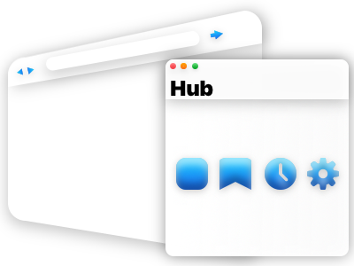

# I'm Making A Browser

[](https://app.codacy.com/gh/VirajShah21/FlexBrowser?utm_source=github.com&utm_medium=referral&utm_content=VirajShah21/FlexBrowser&utm_campaign=Badge_Grade_Settings)


[](https://www.codacy.com/gh/VirajShah21/FlexBrowser/dashboard?utm_source=github.com&utm_medium=referral&utm_content=VirajShah21/FlexBrowser&utm_campaign=Badge_Grade)
[](https://www.codacy.com/gh/VirajShah21/FlexBrowser/dashboard?utm_source=github.com&utm_medium=referral&utm_content=VirajShah21/FlexBrowser&utm_campaign=Badge_Coverage)



One day I installed Microsoft Edge. That's the same thing as Chrome, but with a different frame. So I decided to make my own browser... with a different frame.

- [Contributing](# -contributing)
    - [Contributing Rules](# -contributing-rules)
    - [Style Guide Notes](# -style-guide-notes)
    - [Building](# -building)
    - [Testing](# -testing)
    - [Documentation / Lint Report Generation](# -documentation-lint-report-generation)
- [Dev Tasks](# -dev-tasks)
    - [Improvements](# -improvements)
    - [New Features](# -new-features)

## ✍️ Contributing

### 👩‍⚖️ Contributing Rules

-   New features should branch out from `origin/dev`.
-   All sub-branches for a feature must be merged with their original branch.
-   After merging with feature branch, pull requests should be made to `origin/quality`.
    -   All tests must pass.
    -   There must be **NO** eslint (ts) or tsc errors or warnings.
    -   All code, strings, documentation, and comments must include appropriate grammer and correct spelling.
    -   Built files should not be included in the commit (may be added to gitignore).
    -   All code must be appropriately documented with reasonable length and detail.
    -   Code must be automatically formatted using `.prettierrc`. No other formatting will be accepted.
    -   Code should be written in the simplest form with the following priority:
        -   Readability (30%)
        -   Speed (25%)
        -   Shortest print width (25%)
        -   Fewest number of lines (10%)
        -   Least nesting (conditionals/loops/etc) (10%)
    -   All imports must be used.
    -   Unrelated code should not be touched.
-   All code will be scrutinized with a thorough screening and testing process prior to approving the pull request to `origin/dev`.

### ℹ Style Guide Notes

Style warnings will be provided by eslint (`.eslintrc.js`), TypeScript (`tsconfig.json`), and Prettier (`.prettierrc`).

### 📦 Building

**Step 1: Installing Dependencies**

```bash
npm install
```

**Step 2: Compiling TypeScript**

The project is compiled using TypeScript-parser with webpack.

```bash
webpack
```

**Step 3: Packaging and Making**

```bash
npm run make
```

**Step 4: Run Application**

Navigate to `out/flex-browser-darwin-x64` and click on `flex-browser.app`

### 🧪 Testing

To run all tests, run `npm test`. All tests can be found in `tests/`.

### 📑 Documentation / Lint Report Generation

Documentation and lint report generation is done using the same script.

```bash
source docs.sh
```

## 👨‍💻 Dev Tasks 👩‍💻

### 🛠 Improvements

-   Fix `FontWeight` not working on `TextView` (Branch: `himvc`).
-   Add build-in and build-out animations to everything.
    -   Add animation preferences in hub

### 🆕 New Features

-   **Bookmarks** 🔖
    -   **Bookmark Button** – The ability to add new bookmarks
    -   **Bookmarks Page** DONE – The ability to view bookmarks
-   **First Start Initialization** 1️⃣
    -   **Features Display** – Should give a quick walkthrough of all features.
    -   **Keep track of launches** – A .flexrc.json file should be created after first launch. (Stores preferences).
    -   **Hide other windows** – Hide browser and hub until first start page is finished.
-   **Taskbar customization**
    -   **Partitioning Taskbar** – Create regions, set alignment, and min/max/default sizes
    -   **Picking Items** – Choose browser frame components and insert them into different partitions
-   **Web Apps** 📱
    -   **URL Packager** – Take the current URL and add it as a web app.
    -   **App Drawer** – Launcher for the web apps.
    -   **Frameless Windows** – Add archs for opening frameless webapps.
